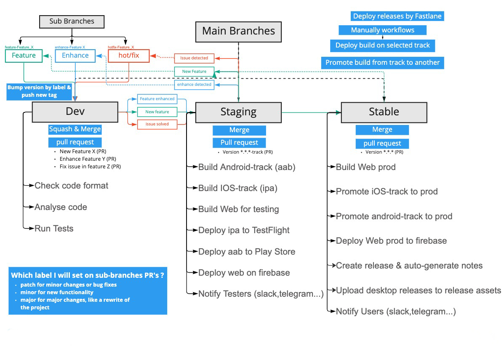

# Flutter CI/CD Template

Welcome to the Flutter CI/CD & Branching Template, crafted to enhance your Flutter app development for Android and iOS platforms through efficient automation.

## Features

### Version Management
- **Version Bumping:** Auto-increment version based on PR labels on `develop` branch.
- **Tag Creation:** Automatically create tags matching the current version.

### Testing & Deployment
- **PR Analysis & Testing:** For PRs on the `develop` branch.
- **Build Number Incrementation:** When merging PRs on the `staging` branch.
- **Android Deployment:** To Play Store's testing track based on labels.
- **iOS Deployment:** To TestFlight and Firebase for testing.
- **Web Deployment:** To production on merging PRs on the `main` branch.

### Notifications & Promotions
- **Notify Testers:** Via Slack, Telegram, etc.
- **Promote to Production:** For Android and iOS on `main` branch merges.
- **Notify Users:** About new releases through Slack, Telegram, etc.

### Release Management
- **Release Creation & Notes:** Based on PRs merged into the `main` branch.
- **Manual Workflows:** For deployment and promotion tasks.

## Getting Started

1. **Template Usage:**
   - Click `Use this template` and select `Include all branches`.
2. **Secrets Configuration:** Add the following to your GitHub Actions secrets:
   - `PLAY_STORE_UPLOAD_KEY`: Your keystore file base64-encoded.
   - `REPO_TOKEN`: Your GitHub personal access token.
   - Keystore details: `KEYSTORE_STORE_PASSWORD`, `KEYSTORE_KEY_PASSWORD`, `KEYSTORE_KEY_ALIAS`.
   - Google Cloud & Play Store: `GCP_SA_KEY`, `PLAY_STORE_CONFIG_JSON`.
3. **Label Setup:** Create versioning (`major`, `minor`, `patch`) and tracking (`production`, `staging`, `develop`) labels as required.

## Workflow Guidance
Adhere strictly to the workflow visualized in the provided workflow image, particularly regarding PR merging strategies.

## Resources & Tools

- [Fastlane](https://fastlane.tools)
- [GitHub Actions Documentation](https://docs.github.com/en/actions/using-workflows)

## Contributing

Your ideas, contributions, and feedback are invaluable to us! Feel free to fork the project, submit issues, or send pull requests. Let's make Flutter development more efficient together!